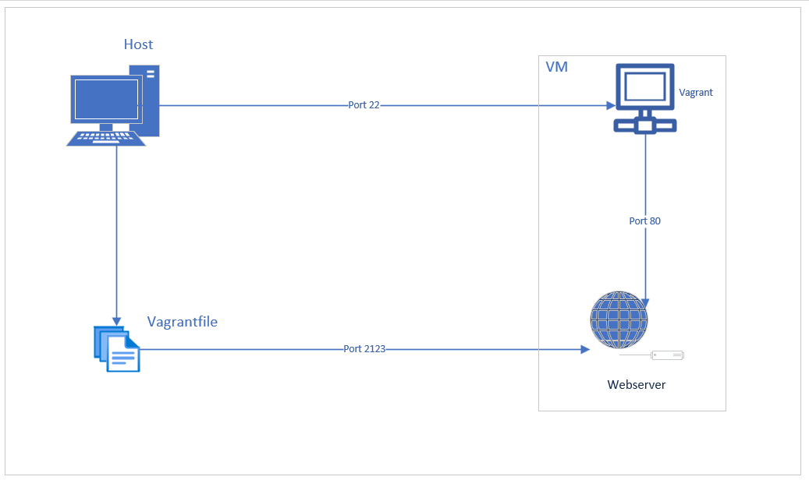

LB2 Dokumentation
==========================================================

### Inhaltsverzeichnis
- Einführung
- Vagrantfile
- Testing
- Quellen

### Einführung

Da viele Leute einen Webserver mit einer Datenbank erstellen, wollten wir etwas "Besondereres" machen. Der Apache2-Webserver läuft im Frontend, daher sollten die Admin- und OPcache-Dienste in der GUI sichtbar sein. PHP und MariaDB werden im Hintergrund ausgeführt, damit die Dienste ordnungsgemäß ausgeführt werden. Auf all dies sollte über die Portweiterleitung zugegriffen werden.

Hierzu hatte ich noch einen Netzwerkplan erstellt.

Auf dem Hostsystem können wir http://localhost:2123 eingeben. Anschliessend leitet dieser die Anfrage an die VM auf Port 80 weiter. Wir sollten in der Lage sein, die Services so nutzen zu können.

