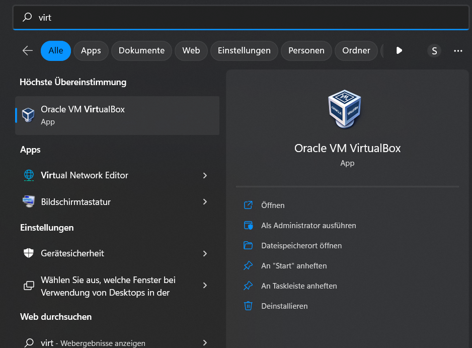
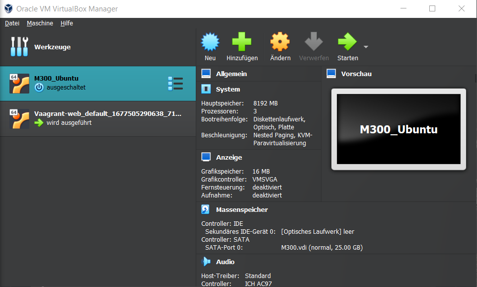
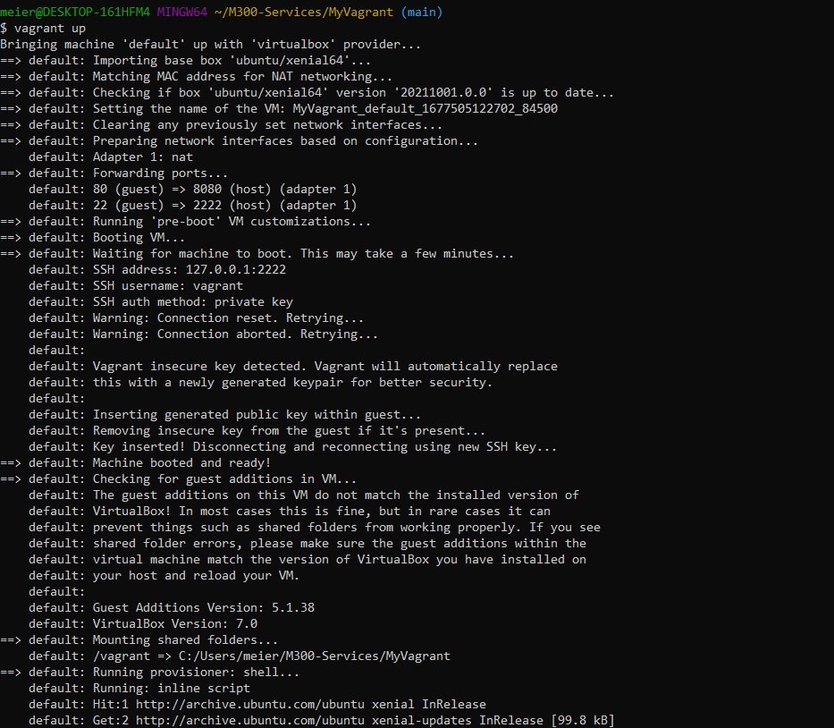
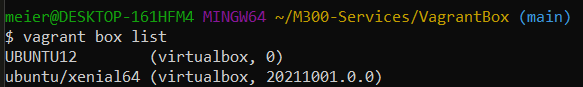
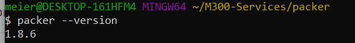
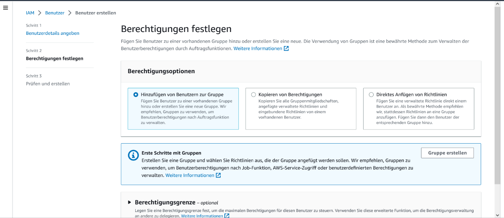
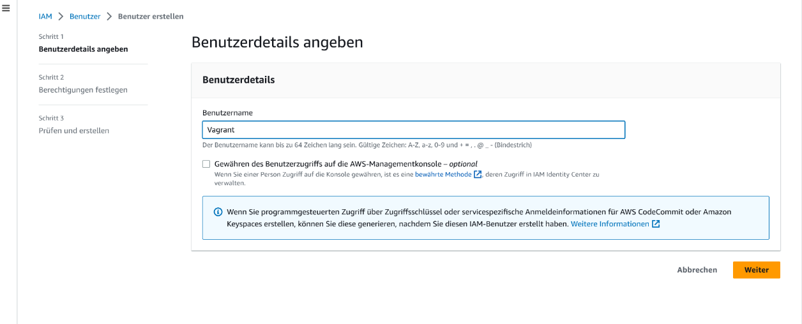
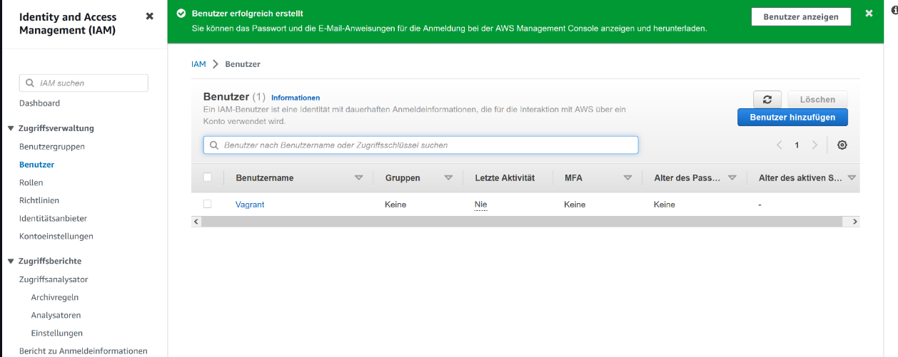
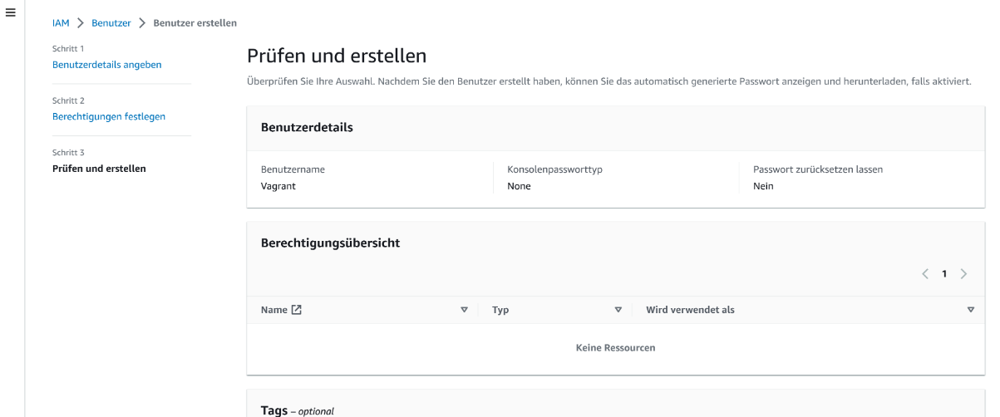
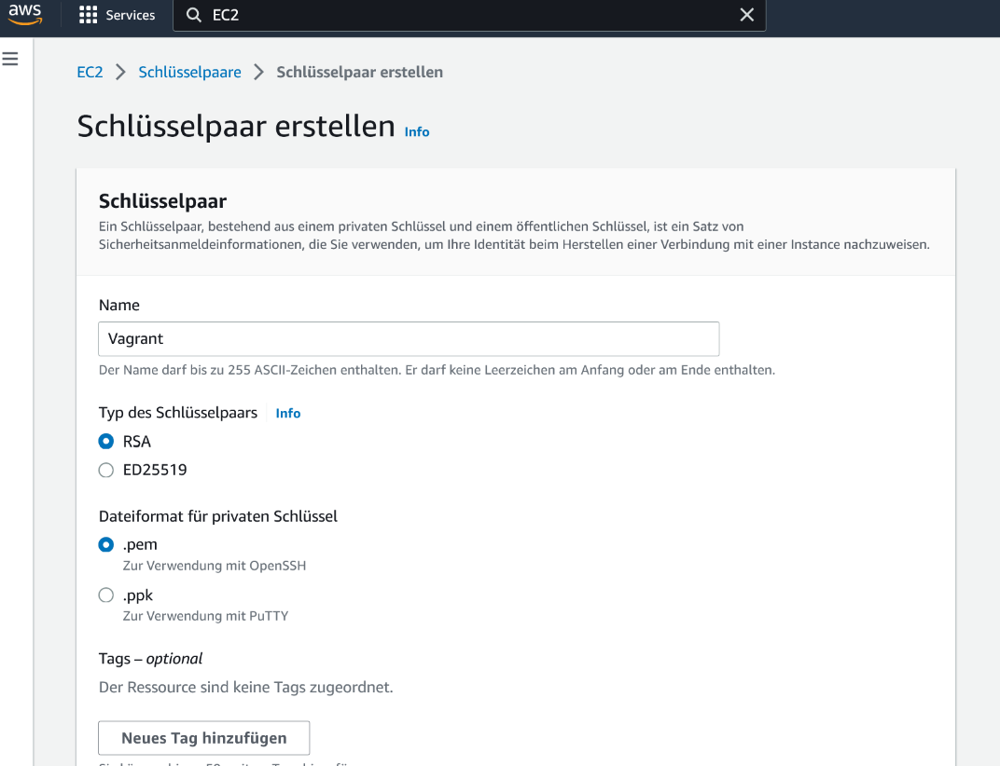

M300 Dokumentation von Silvio Meier
==========================================================

### Lernziele
Die nachstehende Dokumentation zeigt alle Schritte auf, die es zur Einrichtung einer vollständig funktionsfähigen Toolumgebung benötigt werden.

### Inhaltsverzeichnis
* 01 - Github
* 02 - Git Client
* 03 - VirtualBox
* 04 - Vagrant
* 05 - Packer
* 06 - LB2
* 10 - Fazit

---

01 - Github
======

> [⇧ **Nach oben**](#inhaltsverzeichnis)

Als erstes durften wir einen Github Account erstellen und zudem ein Git Repository erstellen. Die beiden Schritte gingen schnell und unkompliziert.
Ich hatte noch einen SSH-Key erstellt in dem Terminal. Als dieser erstellt wurde konnte ich den SSH-Key im GitHub hinzufügen. Dies hat sehr schnell funktioniert und konnten und dadurch konnte ich mich immer direkt anmelden, da ich einen Privat-Key auf meinem Laptop habe.

---

02 - Git Client
======

> [⇧ **Nach oben**](#inhaltsverzeichnis)

### Was ist Git
Git ist eine weit verbreitete Open-Source-Software zur verteilten Versionskontrolle von Software. Lesen Sie hier, wie das Tool unter Windows funktioniert. Git ist ein Versionskontrollsystem, das vom Linux-Erfinder Linus Torvalds entwickelt wurde.

### Wieso wird Git oft von Programmierern gebraucht?
Einige Vorteile von Git
- Paralleles Arbeiten
- Flexibilität
- Performance
- Einfache Beiträge
- Robustheit
- Gemeinschaft und Freiheit
- etc.

### Die wichtigsten Befehle in Git
**Client Konfigurieren**

Informationen mit Hilfe von Git ändern des GitHub Accounts
``` 
$ git config --global user.name "<username>"
$ git config --global user.email "<e-mail>"
```
**Repository clone/pull**

Clone und Pull eines Reporitorys
```
$ git clone https://gitlab.com/ch-tbz-it/Stud/m300/
$ cd M300  
$ git pull
```
**Repository Push**

Git push wird üblicherweise verwendet, um lokale Änderungen in einem zentralen Repository zu veröffentlichen und hochzuladen. Nachdem Änderungen an einem lokalen Repository vorgenommen wurden, werden die Änderungen per Push für Remote-Teammitglieder freigegeben.
```
$ git add -A
$ git commit -m "Mein Kommentar"
$ git push
```
**How to Push**

Hier habe ich noch einige Befehle die man beherschen sollte. 
```Shell 
$  cd Pfad/zu/meinem/Repository    # Zum lokalen GitHub-Repository wechseln

$  git status                      # Geänderte Datei(en) werden rot aufgelistet
$  git add -A                      # Fügt alle Dateien zum "Upload" hinzu
$  git status                      # Der Status ist nun grün > Dateien sind Upload-bereit (Optional) 
$  git commit -m "Mein Kommentar"  # Upload wird "commited" > Kommentar zu Dokumentationszwecken ist dafür notwendig
$  git status                      # Dateien werden nun als "zum Pushen bereit" angezeigt
$  git push                        #Upload bzw. Push wird durchgeführt
```

---

03 - VirtualBox
======

> [⇧ **Nach oben**](#inhaltsverzeichnis)

Ich habe zuerst Virtualbox installiert


Und dannach eine VM manuell erstell


Hier hatte ich einige Probleme, da in der Anleitung stand das die VM 10 GB an Speicherplatz benötigt, doch ist die mindestanforderung 25GB.
Durch diesen Fehler konnte die VM nicht richtig starten und hatte dauernd einen Fehler.

---

04 - Vagrant
======

> [⇧ **Nach oben**](#inhaltsverzeichnis)

Im Prinzip handelt es sich bei Vagrant um ein Werkzeug, das Software zur Virtualisierung wie VirtualBox oder VMware fernsteuern kann. Auf dem Weg ermöglicht es das automatisierte Erstellen von virtuellen Maschinen an Hand einer zuvor erzeugten Konfigurationsdatei.

Mit dem Befehl vagrant ssh kann man sich dann auf die erstellte VM verbinden und dadurch direkt in der VM Befehle ausführen.
### Vagrant Boxen
Boxen sind vorkonfigurierte (Vorlagen) virtuelle Maschinen für Vagrant. Es wurde entwickelt, um die Softwareverteilung und den Entwicklungsprozess zu beschleunigen. Jede vom Benutzer verwendete Box wird auf dem Computer gespeichert und muss nicht erneut aus dem Internet heruntergeladen werden.



---

05 - Packer
======

> [⇧ **Nach oben**](#inhaltsverzeichnis)

Packer funktioniert ähnlich wie vagrant, kümmert sich aber um die Erstellung von Konfigurationsdateien, die Box-Images enthalten.




06 - AWS
======

> [⇧ **Nach oben**](#inhaltsverzeichnis)

Verbindung mit AWS in Vagrant

Vagrant kann mit verschiedenen Cloud Providern verbunden werden, einschließlich AWS von Amazon. Um AWS mit Vagrant zu nutzen, müssen Sie das vagrant-aws Plugin installieren und die dummy Box lokal hinzufügen:

```
vagrant plugin install vagrant-aws
```
```
$ vagrant box add dummy https://github.com/mitchellh/vagrant-aws/raw/master/dummy.box
```

### AWS vorbereiten

01. Falls Sie noch keinen Amazon-Stammbenutzer haben, öffnen Sie die AWS-Website und erstellen Sie einen.
02. Um die schnellste Verbindung zu erhalten, ändern Sie den Rechenzentrum-Standort auf Frankfurt. Sie sollten jedoch berücksichtigen, dass sich dieser je nach Bedarf ändern kann.
03. Erstellen Sie einen AWS-Benutzer, mit dem Vagrant auf "EC2" zugreifen kann.
04. Klicken Sie auf den Benutzernamen oben rechts und dann auf „Sicherheitsanmeldeinformationen“.
05. Erstellen Sie einen neuen Benutzer mit dem Namen „vagrant“ durch Klicken auf „Benutzer“.
06. Verwenden Sie die „Berechtigungsrichtlinie“ „AmazonEC2FullAccess“ für diesen Benutzer.
07. "Frankfurt" als Rechenzentrum ausgewählt ist.
08. Erstellen Sie eine Sicherheitsgruppe, die den VM-Port 22 und 80 zulässt.
09. Schaffen Sie ein Schlüsselpaar und speichern Sie es.pem-Datei in der Hauptverzeichnisse

Hier wäre noch die Grafische erklärung mit Hilfe von Bildern.







Man musste auch noch das Vagrantfile bearbeiten und man musste auch noch den Zugriffsschlüssel mit angeben. Zudem auch noch das .pem-Zertifikat und noch einige weitere Angaben.

